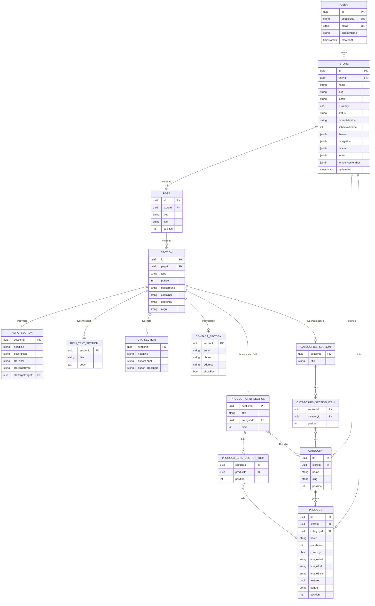

# Data Model

PostgreSQL via Prisma. **Implemented in Phase 3** — the authoritative schema is
`apps/api/prisma/schema.prisma` with the first migration under
`apps/api/prisma/migrations/`. This document tracks the conceptual model and rationale.

## 1. Persistence decision (ADR-006 — normalized, JSON only for presentation tokens)

Resolved 2026-09-01 (revised same day):

- **Section content and all cross-entity references → relational tables.** Class-table style:
  a `sections` base table + one `<type>_sections` content table per section type (1:1), plus
  ordered FK join tables for category/product references. Referential integrity is
  DB-enforced.
- **Store-level presentation → validated JSON on `Store`:** `theme` (`preset`, colors,
  typography, `style` tokens, `components` variant defaults), `navigation`, `header`,
  `footer`, and `announcementBar` are `jsonb` columns, each validated by its Zod sub-schema
  before write — bounded enum/token sets with no cross-row references. `meta` (`name`,
  `tagline`, `locale`, `currency`) are typed columns.
- **Enum strategy (Phase 3):** *structural* enums are Postgres enum types —
  `StoreStatus`, `SectionType`, `LinkTargetType`, `ProductImageKind`, `ProductBadge`.
  *Presentational* layout values (`background`, `container`, `paddingY`, `align`,
  `heroLayout`, `height`, `categoriesLayout`, `productGridLayout`, `contactLayout`,
  `ctaLayout`, `emphasis`, `width`, `imageStyle`) are plain `String` columns guarded by Zod
  on write — the renderer already falls back to a default for any value it does not
  recognise, and these churn as the design system is tuned (Phase 7), so a migration per
  tweak buys little. Promote to a Postgres enum later if a value ever needs DB-level
  integrity.
- **Shared section layout** (`background`, `container`, `paddingY`, `align`) → columns on the
  `sections` base row. Type-specific layout → columns on the matching `<type>_sections`
  table, named `<type>Layout` (e.g. `heroLayout`, `categoriesLayout`) so they never collide
  with the shared `layout`.
- `Store.slug` is derived from `meta.name` by the mapper (Phase 3); uniqueness is per user.
- The **Store Definition** (Zod schema, `packages/shared`) is the contract for generation,
  validation, rendering, and the editor's working copy — **not** the storage format.
- `store-definition.mapper.ts` (`toRows` / `toDefinition`) decomposes a validated definition
  into rows in one transaction and reassembles on read. Round-trip is identity after
  normalization (tested).

## 2. Entities & ownership

```
User
 └─ Store                       (theme jsonb, navigation jsonb, meta columns)
     ├─ Page
     │   └─ Section  (base: type, position)
     │        └─ <type>_sections   (hero_/rich_text_/cta_/contact_/product_grid_/categories_)
     │             ├─ categories_section_items      → Category
     │             └─ product_grid_section_items    → Product
     ├─ Category
     └─ Product  → Category (N:1)
```

Cascade `ON DELETE` down the whole tree from `User`, including `*_section_items`.
Exceptions: `Product.categoryId` = `RESTRICT`; `product_grid_sections.category_id` and all
link-target FKs (`*_target_page_id`, `*_target_section_id`) = `SET NULL`.

## 3. Fields

> Below, `enum(...)` on a *structural* field (SectionType, LinkTargetType, StoreStatus,
> ProductImageKind, ProductBadge) is a Postgres enum. On a *presentational* layout field it
> denotes the bounded set Zod enforces on write — the column itself is `text` (see §1).

**User**: `id` uuid pk, `googleSub` unique, `email` unique citext, `displayName`,
`avatarUrl?`, `createdAt`, `updatedAt`.

**Store**: `id` uuid pk, `userId` fk (cascade), `name`, `slug`, `tagline?`, `locale`,
`currency` char(3), `status` (`draft`|`saved`), `promptText`, `promptVersion`,
`schemaVersion`, `theme` jsonb, `navigation` jsonb, `header` jsonb, `footer` jsonb,
`announcementBar` jsonb (nullable), `createdAt`, `updatedAt`. Unique `(userId, slug)`.
`theme` jsonb carries `preset`, `colors`, `typography`, `style`, `components`.

**Page**: `id` uuid pk, `storeId` fk (cascade), `slug`, `title`, `position` int≥0,
`createdAt`, `updatedAt`. Unique `(storeId, slug)`, `(storeId, position)`.

**Section** (base): `id` uuid pk, `pageId` fk (cascade),
`type` enum(`hero`|`categories`|`productGrid`|`richText`|`contact`|`cta`),
`position` int≥0, and shared layout enums `background`
(`surface`|`muted`|`primary`|`accent`|`gradient`), `container` (`full`|`boxed`|`narrow`),
`paddingY` (`sm`|`md`|`lg`), `align` (`left`|`center`), `createdAt`, `updatedAt`.
Unique `(pageId, position)`.

**hero_sections**: `sectionId` pk/fk (cascade), `headline`, `subheadline?`, `description`,
`ctaLabel`, `ctaTargetType` enum(`page`|`section`|`external`|`none`),
`ctaTargetPageId?` fk (set null), `ctaTargetSectionId?` fk (set null), `ctaTargetUrl?`,
`heroLayout` enum, `height` enum, `overlayStrength` int 0..3.

**rich_text_sections**: `sectionId` pk/fk, `title?`, `body` text, `width` enum.

**cta_sections**: `sectionId` pk/fk, `headline`, `description?`, `buttonLabel`,
`buttonTargetType` enum, `buttonTargetPageId?` fk, `buttonTargetSectionId?` fk,
`buttonTargetUrl?`, `ctaLayout` enum(`banner`|`boxed`|`split`), `emphasis` enum(`subtle`|`bold`).

**contact_sections**: `sectionId` pk/fk, `title?`, `description?`, `email?`, `phone?`,
`address?`, `showForm` bool, `contactLayout` enum(`form-left`|`form-right`|`stacked`).

**product_grid_sections**: `sectionId` pk/fk, `title?`, `categoryId?` fk (set null),
`limit?` int, `productGridLayout` enum(`grid`|`carousel`), `columns` int 2..4,
`cardVariant?` jsonb (productCard override; nullable), `showViewAll` bool.

**categories_sections**: `sectionId` pk/fk, `title?`,
`categoriesLayout` enum(`grid`|`scroller`|`list`), `columns` int 2..4.

**categories_section_items**: `sectionId` fk (cascade), `categoryId` fk (cascade),
`position` int≥0. PK `(sectionId, categoryId)`; unique `(sectionId, position)`.

**product_grid_section_items**: `sectionId` fk (cascade), `productId` fk (cascade),
`position` int≥0. PK `(sectionId, productId)`; unique `(sectionId, position)`.

**Category**: `id` uuid pk, `storeId` fk (cascade), `name`, `slug`, `description?`,
`accentColor?` (hex token, nullable), `position` int≥0. Unique `(storeId, slug)`.

**Product**: `id` uuid pk, `storeId` fk (cascade), `categoryId` fk (restrict), `name`,
`description`, `priceMinor` int `CHECK (>0)`, `currency` char(3),
`imageKind` enum(`placeholder`|`url`), `imageRef`, `imageStyle?`
enum(`photo`|`illustration`|`pattern`|`mono`), `featured` bool default false,
`badge?` enum(`New`|`Limited`|`Bestseller`), `position` int≥0,
`createdAt`, `updatedAt`. Index `(storeId, categoryId)`.

## 4. Constraints & indexes

- All base tables: `createdAt` default now, `updatedAt` auto.
- Unique: `User.googleSub`, `User.email`, `Store(userId, slug)`, `Page(storeId, slug)`,
  `Page(storeId, position)`, `Section(pageId, position)`, `Category(storeId, slug)`,
  each `*_section_items(sectionId, position)`.
- Index: `Store(userId)`, `Store(userId, updatedAt DESC)`, every FK,
  `Product(storeId, categoryId)`.
- Checks: `priceMinor > 0`; every `position >= 0`; a `*_target_url` is non-null iff
  `*_target_type = 'external'`, and the matching `*_target_*_id` is non-null iff the type is
  `page`/`section` (enforced in the mapper; optionally a DB check).

## 5. Write / read flow

- **Write** (`POST`/`PATCH /stores`): validate Store Definition (full pipeline) →
  `mapper.toRows` → **one transaction**: upsert `Store` (incl. `theme`/`navigation` jsonb),
  diff-upsert `Page` / `Section` / `<type>_sections` / `Category` / `Product` and the two
  `*_section_items` join tables, delete removed rows, renumber `position`.
- **Read** (`GET /stores/:id`): bounded indexed joins for the aggregate → `mapper.toDefinition`
  → return `{ definition, ... }` on the wire.
- Wire format stays the Store Definition; normalization is internal.

## 6. Multi-user / multi-store growth

- Row-level `userId` scoping is the isolation model. Scales with indexes → read replicas →
  hash-partitioning `Store` (and children) by `userId` if needed.
- `slug` uniqueness is per-user; add a global `Store.publicSlug` when public storefronts land.
- Auth.js JWT session strategy (ADR-005) → no `Account`/`Session` tables.

## 7. ER diagram (Mermaid)



## 8. Mapper test obligations (Phase 3 build, Phase 9 wiring)

- `toRows` then `toDefinition` == normalized input (round-trip identity).
- Editing one field → minimal row diff (no full delete+recreate; one `UPDATE`).
- Removing a section deletes its base row + `<type>_sections` row + its `*_section_items`;
  `position` stays contiguous.
- A section referencing a category/product/page that isn't in the definition is rejected by
  validation before `toRows` (and would fail the FK anyway).
- Deleting a category still referenced by a product is rejected (`RESTRICT`); deleting one
  referenced only by a `categories_section` / `product_grid_sections.category_id` nulls/removes
  the reference per the rules in §2.
